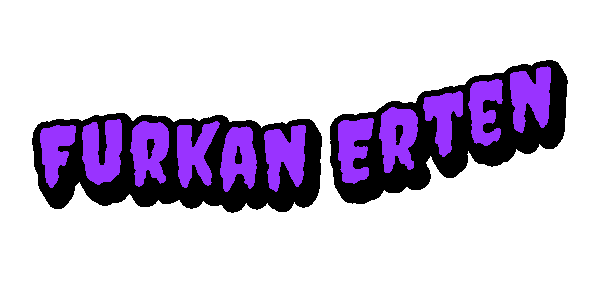

  

<h1 align="center">Hi 👋, I'm Furkan Erten</h1>

<h3 align="center">
  Electrical & Electronics Engineering Student | Embedded Software | Computer Vision | UAV Systems
</h3>

  

  
  
  

---

<h2 align="center">💫 About Me</h2>

  🎓 I am an <b>Electrical & Electronics Engineering</b> student at <b>Bursa Technical University</b>. 
  🧠 I focus on <b>embedded systems, computer vision, UAV systems and real-time software development</b>. 
  🚀 I develop practical engineering projects using <b>Python, C#, .NET, WPF, OpenCV, YOLO, ArduPilot and MAVLink</b>. 
  🛩️ I am interested in <b>autonomous systems, defense technologies, ground control software and embedded AI</b>. 
  ⚙️ I enjoy building systems where <b>software, electronics and real-world hardware</b> work together.

---

<h2 align="center">🌐 Connect with Me</h2>

  
  
  
  

---

<h2 align="center">💻 Tech Stack</h2>

<h3 align="center">Programming Languages</h3>

  

<h3 align="center">Software Development</h3>

  

<h3 align="center">Computer Vision & AI</h3>

  

<h3 align="center">Embedded Systems & Hardware</h3>

  

<h3 align="center">Engineering Tools</h3>

<table align="center">
  <tr>
    <td align="center" width="120">
      
       
      <b>MATLAB</b>
    </td>
    <td align="center" width="120">
      
       
      <b>Simulink</b>
    </td>
    <td align="center" width="120">
      
       
      <b>Proteus</b>
    </td>
    <td align="center" width="120">
      
       
      <b>PSpice</b>
    </td>
    <td align="center" width="120">
      
       
      <b>Gazebo</b>
    </td>
  </tr>
</table>

---

<h2 align="center">🚀 Main Focus Areas</h2>

  
  
  
  
  
  
  

---

<h2 align="center">🛠️ Featured Projects</h2>

<table align="center">
  <tr>
    <td width="50%">
      <h3 align="center">Air Defense Target Tracking System</h3>
      

        Real-time target detection and pan-tilt tracking system using <b>Python, OpenCV, Orange Pi and NEMA17 stepper motors</b>.
      

      

        
        
        
      

    </td>
    <td width="50%">
      <h3 align="center">UAV Ground Control Station</h3>
      

        Desktop-based ground control interface for telemetry visualization, mission tracking and operator-side UAV monitoring.
      

      

        
        
        
        
      

    </td>
  </tr>
  <tr>
    <td width="50%">
      <h3 align="center">Real-Time Target Detection</h3>
      

        Real-time image processing prototype combining camera input, detection logic and tracking output.
      

      

        
        
      

    </td>
    <td width="50%">
      <h3 align="center">Autonomous Tracking Vehicle</h3>
      

        Camera-based autonomous tracking prototype improved with PID control logic for stable movement.
      

      

        
        
        
      

    </td>
  </tr>
</table>

---

<h2 align="center">🏆 Achievements & Certifications</h2>

  🛩️ <b>TEKNOFEST 2025</b> — Fighting UAV Finalist 
  🎮 <b>TEKNOFEST 2020</b> — Educational Technologies Category, Türkiye 11th Place 
  🧠 Turkcell Academy — Machine Learning with Python 
  👁️ Turkcell Academy — OpenCV Image Processing with Python 
  🤖 Turkcell Academy — Deep Learning: CNN, RNN, LSTM 
  🚁 UAV Licenses — İHA-0 and İHA-1

---

<h2 align="center">📊 GitHub Stats</h2>

  
  

  

---

<h2 align="center">🏆 GitHub Trophies</h2>

  

---

<h2 align="center">🔥 Contribution Activity</h2>

  

---

<h2 align="center">🐍 Contribution Snake</h2>

  <picture>
    <source media="(prefers-color-scheme: dark)" srcset="https://raw.githubusercontent.com/FurkanErten/FurkanErten/output/github-contribution-grid-snake-dark.svg">
    <source media="(prefers-color-scheme: light)" srcset="https://raw.githubusercontent.com/FurkanErten/FurkanErten/output/github-contribution-grid-snake.svg">
    
  </picture>

---

<h2 align="center">🎮 Contribution Games</h2>

  <b>💣 Bomberman Contribution Graph</b>

  <picture>
    <source media="(prefers-color-scheme: dark)" srcset="https://raw.githubusercontent.com/FurkanErten/FurkanErten/output/bomberman-contribution-graph-dark.svg">
    <source media="(prefers-color-scheme: light)" srcset="https://raw.githubusercontent.com/FurkanErten/FurkanErten/output/bomberman-contribution-graph.svg">
    
  </picture>

 

  <b>💣🧠 Minesweeper Contribution Graph</b>

  <picture>
    <source media="(prefers-color-scheme: dark)" srcset="https://raw.githubusercontent.com/FurkanErten/FurkanErten/output/minesweeper-contribution-graph-dark.svg">
    <source media="(prefers-color-scheme: light)" srcset="https://raw.githubusercontent.com/FurkanErten/FurkanErten/output/minesweeper-contribution-graph.svg">
    
  </picture>

 

  <b>👾 Pac-Man Contribution Graph</b>

  <picture>
    <source media="(prefers-color-scheme: dark)" srcset="https://raw.githubusercontent.com/FurkanErten/FurkanErten/output/pacman-contribution-graph-dark.svg">
    <source media="(prefers-color-scheme: light)" srcset="https://raw.githubusercontent.com/FurkanErten/FurkanErten/output/pacman-contribution-graph.svg">
    
  </picture>

---

<h2 align="center">⚡ Engineering Motto</h2>

  <b>Türk mühendislerin alnında, Cumhuriyet istikbalini aydınlatan ışık parlar.
"Mustafa Kemal Atatürk"</b>

